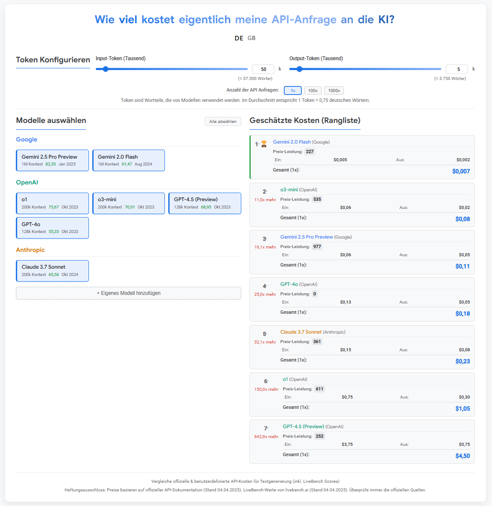

# AI Model Pricing Calculator

A responsive, interactive HTML/CSS/JS calculator to compare API costs for various AI models (including custom ones), designed for easy embedding (e.g., via Elementor). Features LiveBench scores, a calculated Price-Performance (Preis-Leistung) rating, request multiplier, and multilingual support (German/English).

<!-- IMPORTANT: Replace 'screenshot.png' with the actual path/filename after uploading your screenshot -->

## Features

*   **Model Comparison:** Compares pricing for major AI models (Google Gemini, OpenAI GPT series, Anthropic Claude).
*   **Custom Models:** Add your own models with specific pricing via a simple UI.
*   **Multilingual UI:** Switch between German (Deutsch 🇩🇪) and English (English 🇬🇧) interface using flag toggles. Language preference is saved locally.
*   **Interactive Configuration:** Sliders and number inputs for setting Input & Output tokens per request (in thousands).
*   **Word Count Estimation:** Calculates approximate word count based on tokens (using ~0.75 words/token).
*   **Request Multiplier:** Easily calculate total costs for 1, 100, or 1000 API requests with the configured token amounts per request.
*   **LiveBench Scores:** Displays fetched LiveBench Global Average scores for performance context.
*   **Knowledge Cutoff:** Shows the knowledge cutoff date for listed models.
*   **Price-Performance Score (Preis-Leistung):** Calculates a relative score (0-1000) combining performance and cost. See explanation below.
*   **Ranked Results:** Displays cost estimates sorted cheapest to most expensive, including rank, cost difference multiplier, and Preis-Leistung score.
*   **Responsive Design:** Adapts layout for different screen sizes (desktop, tablet, mobile).
*   **Self-Contained:** All necessary HTML, CSS, and JavaScript are in a single file for easy embedding.

## How to Use

1.  Download the `index.html` file from this repository.
2.  Open the `index.html` file directly in any modern web browser (Chrome, Firefox, Edge, Safari recommended).
    *   *Alternatively:* Copy the entire content of `index.html` and paste it into an HTML widget or code block in website builders like Elementor.
3.  Use the sliders/number inputs to set the typical Input and Output tokens for *a single API request*.
4.  Use the "1x", "100x", "1000x" buttons to see the total cost estimate for that many requests.
5.  Use the flag icons (🇩🇪 / 🇬🇧) in the header to switch languages.
6.  Select/deselect models on the left to compare costs and Preis-Leistung scores on the right.
7.  Click "+ Eigenes Modell hinzufügen" / "+ Add Custom Model" to input details for models not listed.

## Data Sources & Disclaimer

*   **Pricing:** Based on publicly available official API documentation accessed around April 4, 2025. **Always verify costs directly with the provider documentation** as pricing changes frequently.
*   **LiveBench Scores:** Sourced from livebench.ai around April 4, 2025. These scores also change; check the source for the latest benchmarks.
*   **Knowledge Cutoff:** Based on information available around April 4, 2025. Verify with official model documentation.
*   **Token/Word Ratio:** Uses an approximation of 1 token ≈ 0.75 words (German/English). This can vary significantly based on language and content.

## Preis-Leistungs-Score Explained

The "Preis-Leistung" (Price-Performance) score (0-1000, higher is better) provides a relative value assessment based *only on the models currently selected for comparison*. It works like this:

1.  **Normalization:** For selected models with valid LiveBench scores and non-zero total costs (for the selected number of requests), the scores and costs are separately normalized to a 0-1 range (lowest=0, highest=1 within the selection).
2.  **Calculation:** A raw value is calculated using the formula: `Normalized Score / (1 + Normalized Cost)`. This rewards higher performance while penalizing higher costs more significantly than a simple ratio.
3.  **Scaling:** The raw value is multiplied by 1000 and rounded to give a score between 0-1000.
4.  **Edge Cases:** Models without a `liveBenchScore` show "N/A". Models with effectively zero cost (for the given configuration) show "Sehr Hoch" / "Very High".

*Note: This score is relative and highly dependent on the specific models you choose to compare and the configured token amounts/request multiplier.*

## Contributing

Contributions are welcome! Please see the [CONTRIBUTING.md](CONTRIBUTING.md) file for guidelines.

## License

This project is licensed under the MIT License - see the [LICENSE](LICENSE) file for details.
