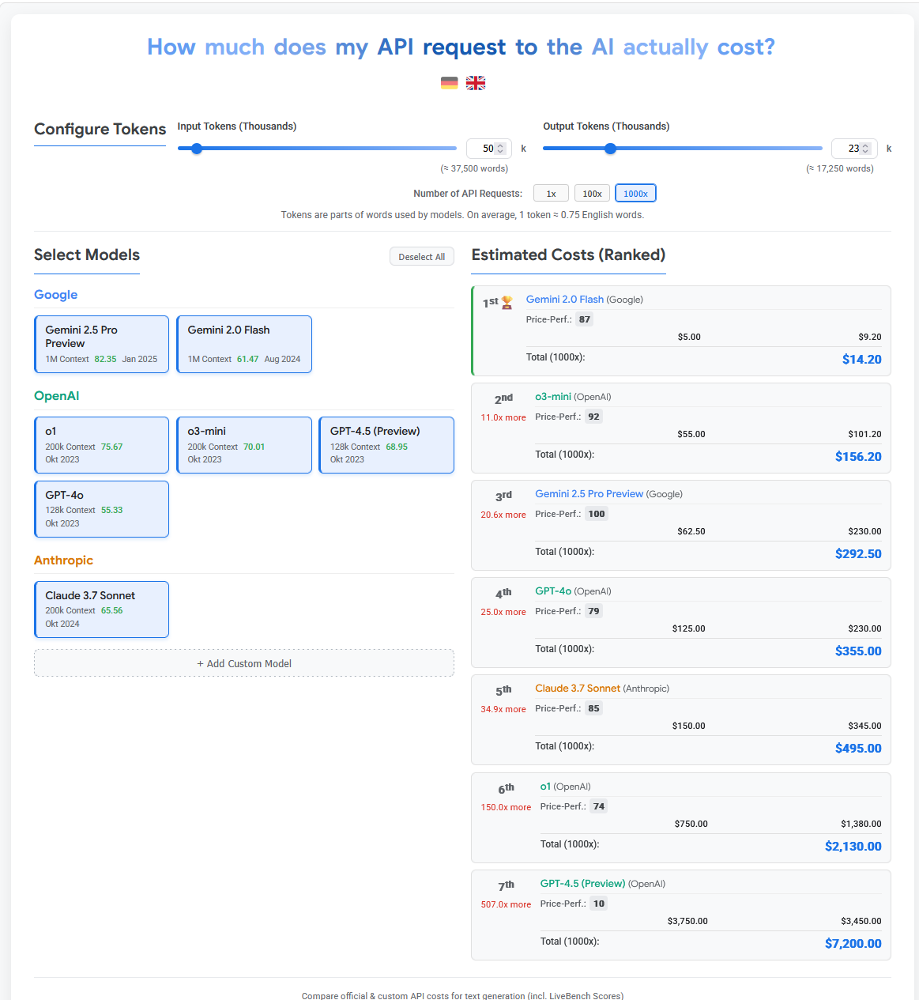

# LLM (AI Model) Pricing Calculator in German and English

A responsive, interactive HTML/CSS/JS calculator to compare API costs for various AI models (including custom ones), designed for easy embedding (e.g., via Elementor). Features LiveBench scores, a calculated Price-Performance (Preis-Leistung) rating, request multiplier, and multilingual support (German/English).

## Features

*   **Model Comparison:** Compares pricing for major AI models (Google Gemini, OpenAI GPT series, Anthropic Claude).
*   **Custom Models:** Add your own models with specific pricing via a simple UI.
*   **Multilingual UI:** Switch between German (Deutsch 🇩🇪) and English (English 🇬🇧) interface using flag toggles. Language preference is saved locally.
*   **Interactive Configuration:** Sliders and number inputs for setting Input & Output tokens per request (in thousands).
*   **Word Count Estimation:** Calculates approximate word count based on tokens (using ~0.75 words/token).
*   **Request Multiplier:** Easily calculate total costs for 1, 100, or 1000 API requests with the configured token amounts per request.
*   **LiveBench Scores:** Displays fetched LiveBench Global Average scores for performance context.
*   **Knowledge Cutoff:** Shows the knowledge cutoff date for listed models.
*   **Price-Performance Score (Preis-Leistung):** Calculates a score (0-100) balancing performance (LiveBench) and cost-effectiveness based on a configurable weighting (currently 20% Performance / 80% Cost). See explanation below.
*   **Ranked Results:** Displays cost estimates sorted cheapest to most expensive, including rank, cost difference multiplier, and the calculated Preis-Leistung score.
*   **Responsive Design:** Adapts layout for different screen sizes (desktop, tablet, mobile).
*   **Self-Contained:** All necessary HTML, CSS, and JavaScript are in a single file for easy embedding.

## How to Use

1.  Download the `index.html` file from this repository.
2.  Open the `index.html` file directly in any modern web browser (Chrome, Firefox, Edge, Safari recommended).
    *   *Alternatively:* Copy the entire content of `index.html` and paste it into an HTML widget or code block in website builders like Elementor.
3.  Use the sliders/number inputs to set the typical Input and Output tokens for *a single API request*. This ratio also influences the Price-Performance calculation.
4.  Use the "1x", "100x", "1000x" buttons to see the total cost estimate for that many requests.
5.  Use the flag icons (🇩🇪 / 🇬🇧) in the header to switch languages.
6.  Select/deselect models on the left to compare costs and Preis-Leistung scores on the right.
7.  Click "+ Eigenes Modell hinzufügen" / "+ Add Custom Model" to input details for models not listed.

## Data Sources & Disclaimer

*   **Pricing:** Based on publicly available official API documentation accessed around April 4, 2025. **Always verify costs directly with the provider documentation** as pricing changes frequently.
*   **LiveBench Scores:** Sourced from livebench.ai around April 4, 2025. These scores also change; check the source for the latest benchmarks.
*   **Knowledge Cutoff:** Based on information available around April 4, 2025. Verify with official model documentation.
*   **Token/Word Ratio:** Uses an approximation of 1 token ≈ 0.75 words (German/English). This can vary significantly based on language and content.

## Preis-Leistungs-Score Explained

The "Preis-Leistung" (Price-Performance) score (**0-100**, higher is better) provides a value assessment that balances model performance (intelligence) against its cost-effectiveness. It uses the **"Balanced Score & Cost" (BSC)** algorithm:

1.  **Blended Cost Calculation:** For *all* available models (base + custom), a `Blended Cost per 1 Million Tokens` is calculated. This cost uses the model's *base* input/output prices and weights them according to the **current Input/Output token ratio configured by the user**.
2.  **Normalization:** For all models with a valid `LiveBench Score` and a calculable (non-negative) `Blended Cost`:
    *   LiveBench scores are normalized to a 0-1 range (`normScore`), where 1 is the best score among all valid models.
    *   Blended Costs are normalized to a 0-1 range (`normCost`), where 0 is the best (cheapest) cost. This is then inverted (`normCostPerf = 1 - normCost`) so that 1 represents the best cost-effectiveness.
3.  **Weighted Combination:** The normalized values are combined using adjustable weights (currently **20% performance, 80% cost**):
    `rawCombinedScore = (0.2 * normScore) + (0.8 * normCostPerf)`
4.  **Final Scaling:** The `rawCombinedScore` for each model is scaled relative to the *highest* `rawCombinedScore` found among all valid models. This result is rounded and clamped to produce the final score between **0 and 100**.
    `finalPlScore = round( (rawCombinedScore / maxRawCombinedScore) * 100 )`
5.  **Handling Invalid Models:** Models without a valid `LiveBench Score` or where the `Blended Cost` cannot be calculated (e.g., 0 input and 0 output tokens configured) will show "N/A" for the score.

*Note: This score provides a balanced view based on the specified weights. Adjusting the input/output token ratio will change the `Blended Cost` and thus can influence the final Price-Performance scores.*

## Contributing

Contributions are welcome! Please see the [CONTRIBUTING.md](CONTRIBUTING.md) file for guidelines.

## License

This project is licensed under the MIT License - see the [LICENSE](LICENSE) file for details.
